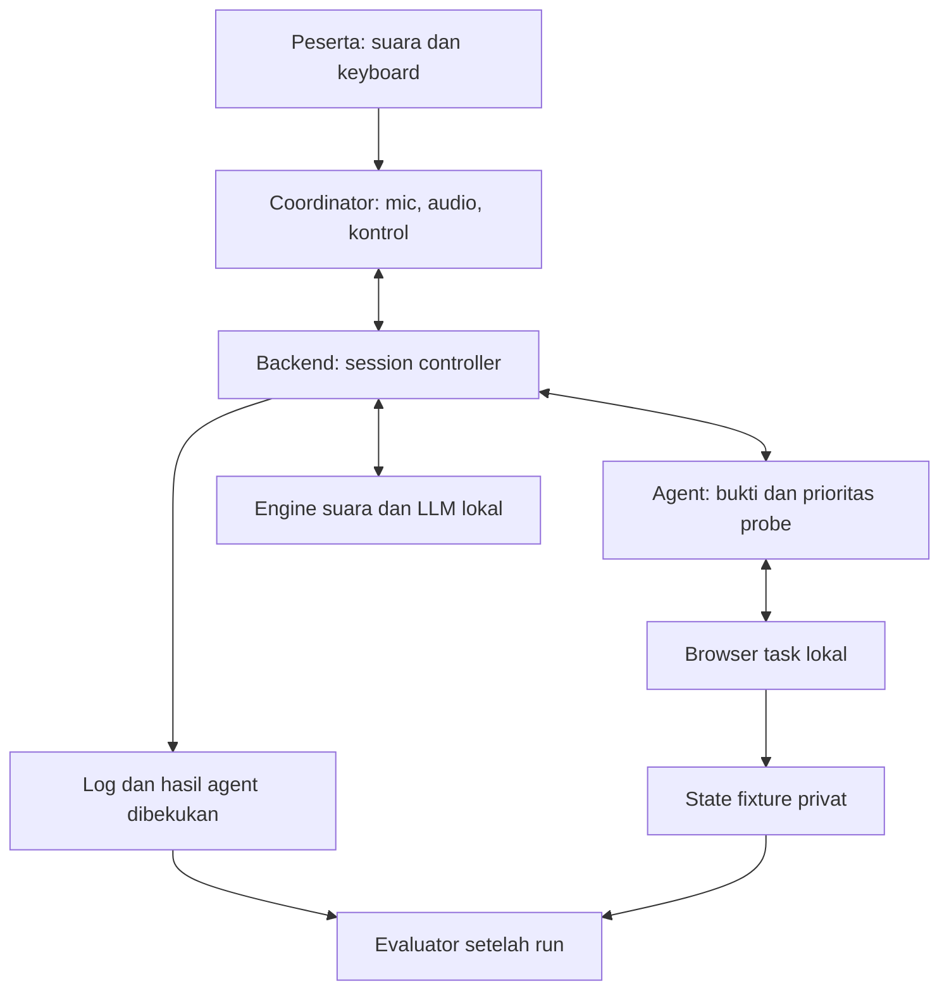

# Product Requirements Document
# Accessibility-Aware Computer-Use Agent dengan Eksplorasi Berbasis Constraint

**Versi 4.0 · 6 September 2026 · Research MVP lokal untuk skripsi S1**

**Status:** spesifikasi referensi berdasarkan persetujuan kandidat B. Delta implementasi setelah audit ada di [PRD-REVISION.md](PRD-REVISION.md); dokumen ini tidak menyatakan model lokal, benchmark, atau studi peserta sudah berhasil diuji.

**Pemilik:** mahasiswa sebagai Product Owner/Peneliti. **Pembaca:** implementer, AI coding agent, pembimbing, dan reviewer.

## 1. Keputusan yang dikunci

Versi ini menggantikan requirement versi sebelumnya untuk pengembangan berikutnya. Jangan menggabungkan kembali eksperimen verifier-versus-LLM, empat keluarga task, atau protokol studi lama. **WAJIB**, **DILARANG**, dan **DITUNDA** adalah ketentuan normatif. Angka pada §17 merupakan satu sumber batas runtime.

| Area | Keputusan v4 |
|---|---|
| Mekanisme penelitian utama | Memilih pemeriksaan browser berikutnya berdasarkan constraint tujuan yang belum terjawab dan bukti semantik yang sudah diperoleh. |
| P vs B1 | Hanya fungsi prioritas pemeriksaan yang berbeda. B1 juga bisa mengeksplorasi tahap berikutnya. |
| Verifikasi semantik | Wajib dan identik pada kedua kondisi; supporting mechanism, bukan variabel eksperimen utama. |
| MVP task | Satu keluarga: memilih produk dan varian, lalu menambahkan tepat satu barang ke keranjang sintetis. |
| Batas eksplorasi | Tiga produk, dua tingkat detail, empat aksi pemeriksaan maju; tanpa search tree besar atau browser cloning. |
| Pengguna | Pelajar/mahasiswa tunanetra dewasa, berbahasa Indonesia; tidak memerlukan sisa penglihatan. |
| Runtime | Komputer peneliti, satu backend, satu sesi, satu browser task lokal. |
| Biaya layanan | Rp0 API/hosting. Seluruh inferensi lokal; tidak ada free trial atau fallback berbayar. |
| Interaksi | Voice-first; mic otomatis saat menjawab dan ketika agent bekerja tanpa TTS. Escape tetap menjadi stop darurat. |
| Evaluasi | Benchmark berpasangan 64 episode; pilot pengguna terpisah dan studi eksploratif empat peserta utama. |
| Data penelitian | Event log, hasil oracle, JSON/CSV. Tanpa kamera, screen recording, atau penyimpanan raw audio. |

Judul kerja yang paling mencerminkan variabel penelitian:

> **Perancangan dan Evaluasi Accessibility-Aware Computer-Use Agent Berbasis Accessibility Tree dengan Eksplorasi Terarah oleh Constraint untuk Penyelesaian Tugas Web bagi Pengguna Tunanetra.**

Judul lama yang menonjolkan verifikasi semantik boleh dipertahankan sementara untuk administrasi. Persetujuan judul akhir tetap milik peneliti/pembimbing; abstrak, RQ, dan eksperimen wajib menjelaskan bahwa kebijakan eksplorasi adalah variabel utama.

## 2. Masalah, research gap, dan batas kontribusi

### 2.1 Masalah yang diselesaikan

Pilihan yang terlihat cocok pada daftar belum tentu memenuhi tujuan setelah detail dibuka. Harga awal bisa berbeda dari harga varian yang diminta; ukuran yang ditampilkan bisa tidak tersedia. Agent perlu menentukan informasi mana yang harus dicari sebelum mengajak pengguna menetapkan pilihan.

Bagi pengguna tunanetra, koreksi pilihan dan penelusuran ulang menambah percakapan dan beban memahami state yang tidak terlihat. Namun kegagalan ini tidak eksklusif terjadi pada pengguna tunanetra. Dampak khusus terhadap pengalaman nonvisual harus dievaluasi, bukan diasumsikan.

**Causal story yang diuji:** budget interaksi terbatas → prioritas eksplorasi umum dapat menghabiskan aksi pada detail yang kurang menentukan → kebijakan yang mengarahkan pemeriksaan ke syarat belum terbukti dapat memperoleh bukti kelayakan lebih cepat → lebih banyak task selesai dengan bukti yang benar pada budget yang sama.

### 2.2 Landasan dan overlap

| Prior work | Temuan yang relevan | Konsekuensi rancangan |
|---|---|---|
| [A11y-CUA, CHI 2026](https://arxiv.org/html/2602.09310v1) | Kesenjangan performa/pola interaksi CUA dalam kondisi assistive technology. | Motivasi accessibility; bukan bukti kausal bahwa AX mengalahkan vision. |
| [Savant, ASSETS 2024](https://arxiv.org/html/2407.19537v2) | Aksi melalui representasi semantik dan evaluasi dengan pengguna blind sudah ada. | AX, bahasa alami, eksekusi otomatis, dan peserta tunanetra bukan kebaruan tersendiri. |
| [Morae, UIST 2025](https://arxiv.org/html/2508.21456v1) | Mengumpulkan informasi UI dan berhenti untuk pilihan pengguna berdasarkan ambiguitas/kecukupan informasi. | Tidak mengklaim penemuan keputusan inspect/ask/act. Pembeda diuji pada prioritas probe antaralternatif. |
| [AskEase, CHI 2026](https://arxiv.org/html/2601.18092v1) | Guidance kontekstual bagi pengguna screen reader; pengguna menjalankan aksi. | Rujukan interaksi pengguna, bukan baseline teknis utama autonomous planning. |
| [Are We There Yet? / OLLA, manuscript September 2026](https://arxiv.org/html/2609.00524v1) | Studi penggunaan oleh delapan pengguna blind melaporkan masalah jalur tersembunyi, grounding, dan konteks. Metadata penulis menyatakan diterima di EMNLP 2026 Main. | Mendukung relevansi masalah agent-level; besar efek desktop mereka tidak dipindahkan ke web MVP ini. |
| [MAESTRO, camera-ready UIST 2026](https://arxiv.org/html/2604.06134v2), §5.2.3 | Peserta menginginkan pemeriksaan kelayakan di tahap berikutnya yang belum didukung sistem tersebut. Studi bukan pada populasi BLV. | Motivasi konkret untuk pemeriksaan tahap berikutnya; bukan klaim seluruh literatur belum memiliki lookahead. |
| [Tree Search for Language Model Agents, manuscript mulai 2024](https://arxiv.org/html/2407.01476v4) | Pencarian melalui state web nyata dengan budget dan backtracking. | Lookahead sudah established; B1 harus mampu melakukan pemeriksaan nyata dengan budget sama. |
| [LiveLedger, preprint 2026](https://arxiv.org/html/2602.07549v1) | Status satisfied/refuted/unknown per kandidat dan constraint telah digunakan. | Matriks bukti menjadi fasilitas bersama, bukan novelty utama. |

Penelusuran tersebut mendukung **hipotesis desain dan kontribusi empiris yang terfokus**, bukan klaim algoritma pertama. Risiko overlap tetap ada. Representasi semantik yang lebih terstruktur juga tidak otomatis lebih baik; hasil ablation [A11y-Compressor, ACL 2026 SRW](https://aclanthology.org/2026.acl-srw.50/) mendukung perlunya pembandingan, bukan asumsi manfaat.

### 2.3 RQ dan novelty statement

**RQ1 — utama:** Dengan informasi awal, model, alat, aturan kelayakan, dan budget yang sama, apakah pemilihan probe berdasarkan constraint meningkatkan keberhasilan objektif dibanding pemilihan probe berdasarkan penilaian kemajuan umum LLM?

**RQ2 — mekanisme:** Apakah perbedaan itu terkait dengan perolehan bukti constraint yang lebih efisien, terutama ketika informasi penentu baru muncul pada tahap berikutnya?

**RQ3 — penggunaan:** Bagaimana pengguna tunanetra memahami hasil, memberi koreksi, dan menyelesaikan task melalui alur suara; serta apa pola intervensi dan beban interaksi pada kedua kondisi?

> Penelitian ini merancang dan mengevaluasi kebijakan eksplorasi terbatas yang menggunakan constraint tujuan dan bukti accessibility tree untuk memeriksa kelayakan pilihan pada tahapan web berikutnya, serta menguji pengaruhnya terhadap keberhasilan tugas dan kebutuhan intervensi pengguna tunanetra.

Klaim dibatasi pada keluarga tugas, semantik, model, perangkat, dan peserta yang diuji. Tidak mengklaim superioritas AX terhadap screenshot, agent universal, atau peningkatan besar sebelum hasil tersedia. Hasil tidak berbeda atau lebih buruk tetap merupakan hasil penelitian yang sah.

### 2.4 Peta kontribusi

| Komponen | Kedudukan |
|---|---|
| Prioritas probe berdasarkan constraint | Mekanisme utama yang dibandingkan; spesialisasi metode pencarian, dengan manfaat empiris yang belum terbukti. |
| AX, semantic action, matriks bukti | Fondasi bersama; tidak diisolasi sebagai penyebab peningkatan. |
| Planner lokal | Mendukung interpretasi goal dan kontrol; bukan model ML baru. |
| Post-action verification dan bounded recovery | Reliability bersama, bukan klaim novelty utama. |
| Voice-first dan kontrol pengguna | Interaction layer yang dievaluasi secara eksploratif. |
| Fixture, hidden oracle, metrik | Infrastruktur metodologi dan kontribusi reproducibility. |
| Deployment, export, startup tooling | Supporting engineering. |

## 3. Scope dan non-goals

### 3.1 Pengalaman peserta

Peneliti menyiapkan perangkat. Peserta membuka URL lokal, mendengarkan penjelasan/consent, memulai dan memberi permission mikrofon, menyelesaikan readiness check, lalu berbicara secara natural. Agent mencari bukti, menyampaikan satu pilihan yang memenuhi syarat, meminta satu persetujuan memasukkan barang, memverifikasi keranjang, dan menawarkan task berikutnya melalui suara.

Peserta tidak membuka terminal, memasang extension, melihat task browser, atau memahami Playwright. Mikrofon dan keyboard tersedia; headphone disarankan. Peserta tetap boleh memakai screen reader pada aplikasi peserta.

### 3.2 Termasuk

- Satu keluarga web task realistis dengan beberapa bentuk halaman dan data sintetis.
- Goal Bahasa Indonesia, dua atau tiga hard constraint yang didukung.
- Eksekusi browser nyata, bukti semantik, eksplorasi dangkal, verifikasi, recovery terbatas.
- Koreksi, ulang, skip, stop, dan transisi task tanpa klik setelah kesiapan awal.
- Benchmark P/B1, oracle independen, log lokal, ekspor JSON/CSV.
- Panel peneliti kecil: readiness, mulai studi/benchmark, abort, status, export, delete.

### 3.3 Dikeluarkan atau ditunda

Tidak ada checkout, pembayaran, akun, CAPTCHA, OTP, reservasi stok, website publik bebas, mobile, camera, screen recording, video streaming browser, takeover, extension peserta, custom model training, multi-agent, cloud orchestration, atau browser cloning.

Task perjalanan, konsultasi, dan profil **DITUNDA**. PDF report, provider fallback, persistent audio cache peserta, remote hosting, serta live dashboard analitik **DITUNDA**. Tidak mendukung optimasi “termurah/terbaik dari semuanya” pada eksperimen utama; goal meminta **salah satu pilihan yang memenuhi semua syarat**.

## 4. Task dan controlled environment

### 4.1 Kontrak task

**FR-T01.** Setiap episode dimulai dari keranjang kosong dan daftar tepat tiga produk. Identitas publik produk berasal dari judul unik dan URL produk yang ditampilkan; bukan ID jawaban evaluator. Urutan produk stabil dalam episode dan diacak antar-instance.

**FR-T02.** Goal meminta satu barang, varian yang ditentukan, dan batas harga. Dua predicate wajib adalah `variant_available(size, color)` dan `variant_price(size, color) <= max_price`. Predicate ketiga opsional adalah `material == requested_material`. Ukuran/warna merupakan scope varian, bukan perkiraan dari gambar. Harga berupa integer rupiah per unit; tidak ada ongkir, diskon personal, atau pajak tambahan.

Contoh: “Cari salah satu kaos biru ukuran M, maksimal seratus lima puluh ribu, yang tersedia. Masukkan satu ke keranjang.” Goal dengan bahan katun menambah predicate ketiga. Nilai ukuran, warna, harga, dan bahan berasal dari goal/ucapan, bukan dari metadata task privat.

**FR-T03.** Hasil sukses adalah keranjang berisi tepat satu line item, produk dan varian memenuhi seluruh goal, quantity satu, harga unit benar, dan tidak ada checkout. “Membuka detail”, “opsi terlihat”, atau “klik berhasil” bukan akhir task.

**FR-T04.** Navigasi maksimal dua aksi maju dari daftar: misalnya daftar → detail → tab stok, atau daftar → detail → pilihan varian. Memilih varian hanya mengubah state tampilan sampai tombol tambah ditekan. Setiap detail menyediakan kontrol kembali yang terlihat dan dapat diakses. Tidak ada efek samping ketika membaca detail, timer promo, lazy loading, atau scroll untuk memunculkan fakta.

Untuk memenuhi depth tersebut, ukuran+warna dipilih melalui satu kontrol varian gabungan, atau satu tab menampilkan tabel harga/stok seluruh varian. Jangan membuat alur wajib buka detail → pilih warna → pilih ukuran → buka stok. Detail menyajikan atribut umum seperti bahan; aksi tingkat kedua menyajikan atribut varian. Batas depth berlaku pada eksplorasi bukti, bukan menganggap aksi commit sebagai informasi gratis.

**FR-T05.** Konten tersedia memakai role/name/heading/group/label/value yang benar. Panel tertutup tidak boleh membocorkan isinya dalam AX. Kontrol dapat menggunakan label semantik berbeda pada template berbeda; DILARANG menambah atribut seperti `answers_constraint`, `correct_option`, atau `oracle_success` untuk membantu agent.

### 4.2 Variasi yang harus ada

- Harga daftar berupa “mulai dari”; harga varian dapat berbeda.
- Varian tersedia/tidak tersedia dan pilihan lain yang tampak menarik tetapi tidak cocok.
- Detail relevan serta detail yang tidak menjawab constraint, misalnya tab bahan versus stok.
- Semua bukti langsung tersedia; bukti hanya muncul di detail; dan bukti memang tidak tersedia.
- Lebih dari satu pilihan sesuai, tidak ada pilihan sesuai, serta urutan kandidat yang tidak selalu menguntungkan P.

Empat template presentasi ringan memakai data dan aturan domain yang sama; bukan empat aplikasi. Distribusi isi, posisi opsi sesuai, dan branch yang informatif ditetapkan sebelum benchmark utama. Semantic contract adalah kontrak halaman publik; bukan daftar langkah penyelesaian per seed.

## 5. Runtime dan pembagian tanggung jawab

### 5.1 Topologi tunggal

Komputer peneliti menjalankan aplikasi di `http://localhost:3050`. Chrome peserta membuka **Coordinator**, sedangkan backend menjalankan **Chromium terpisah** untuk task. Keduanya tidak berbagi tab, iframe, cookies, atau sesi login. Participant tidak mengendalikan browser pribadinya lewat agent.

Browser task memuat hanya fixture lokal pada route `/task/…`. Coordinator berada di `/study`; panel peneliti di `/research`. Halaman task tidak membuka popup atau tab baru. Backend menolak navigasi di luar origin/route allowlist. Egress browser diblokir selama run.



Panah menuju evaluator tidak berarti data privat diberikan ke agent. Oracle tidak memiliki jalur balik ke loop agent.

### 5.2 Ownership

| Bagian | Tanggung jawab tunggal | Dilarang |
|---|---|---|
| Frontend | Consent UI, mic/VAD, pemutaran audio, keyboard stop, render status | Memilih aksi browser atau memutuskan task success. |
| Session controller | State, deadline, ID, dispatch gate, approval, antrean tunggal, cleanup | Menjalankan dua run bersamaan. |
| Voice adapter | STT/TTS lokal, giliran, command parsing sederhana | Menjadikan transkrip ambigu sebagai approval. |
| Goal/parser dan planner | Parse tujuan; interpretasi fungsi probe dan skor umum | Membaca oracle atau mengeluarkan kode browser bebas. |
| Observer/evidence store | AX, reference registry, fakta bersumber, status constraint | Menafsirkan tidak adanya fakta sebagai false. |
| Probe router | Memilih probe dengan P atau B1 | Mengubah model, prompt, verifier, atau budget antar-kondisi. |
| Executor/policy | Satu aksi legal, guard target, approval dan safety | Script bebas, koordinat, XPath/CSS yang diajukan model. |
| Verifier/recovery | Membandingkan postcondition dengan observasi publik baru | Memakai jawaban fixture sebagai bukti runtime. |
| Fixture/evaluator | Dunia sintetis dan penilaian objektif setelah run | Mengirim skor, seed, atau jawaban ke planner. |

Implementasi berupa satu aplikasi Node.js/TypeScript modular, frontend React yang sudah ada, Playwright, Zod, dan SQLite lokal. Ollama serta worker STT/TTS adalah proses lokal yang diperlukan; bukan microservices produk. Tidak menambah database jaringan, message broker, atau framework orchestration.

## 6. Kontrak data, AX, dan grounding

### 6.1 Data inti

```ts
type EvidenceStatus = 'SATISFIED' | 'REFUTED' | 'UNKNOWN';
type CheckStatus = 'PASS' | 'FAIL' | 'UNKNOWN';

type Goal = {
  revision: number;
  size: string; color: string; maxPriceIdr: number;
  material?: string;
  quantity: 1;
};

type Fact = {
  candidateKey: string;       // identitas publik, tanpa jawaban privat
  field: 'availability' | 'variantPrice' | 'material';
  value: boolean | number | string;
  variantScope?: { size: string; color: string };
  observationId: string;
  sourceRefs: string[]; sourceText: string;
};

type SemanticDescriptor = {
  role: 'link' | 'button' | 'tab' | 'combobox';
  exactName: string;
  ownerKey: string;
  scopeHeading: string;
  publicUrl?: string;
};

type RouteStep = {
  target: SemanticDescriptor;
  kind: 'RETURN' | 'OPEN_DETAIL' | 'OPEN_INFO' | 'SET_VARIANT';
  optionLabel?: string;
};

type Probe = {
  probeId: string; ownerKey: string;
  sourceViewKey: string; controlDescriptor: SemanticDescriptor;
  route: RouteStep[];         // hanya kontrol yang pernah diamati
  forwardCost: number; totalActionCost: number;
  depth: 1 | 2; initialOrder: number;
};
```

Schema divalidasi dan registry menyimpan precondition state untuk setiap binding. Descriptor historis digunakan untuk re-observe/rebinding, bukan langsung sebagai izin mengeksekusi target lama. Descriptor tidak boleh memuat script atau selector jawaban.

**FR-D01.** Semua perintah/asynchronous result membawa `session_id`, `run_id`, `epoch`, `goal_revision`; tambahan sesuai konteks: `turn_id`, `observation_id`, `step_id`, `attempt_id`, `confirmation_id`, `event_seq`. Ini identifier lokal, tidak pernah menjadi label jawaban model.

**FR-D02.** Goal parser menerima instruksi task publik, transkrip, dan Goal sebelumnya bila koreksi. Output union: `READY {goal}`, `ASK_CLARIFICATION {field, question}`, atau `UNSUPPORTED {reason}`. Field yang belum disebut tidak boleh diisi dari jawaban fixture; quantity hanya satu, harga integer positif, ukuran/warna wajib. Klarifikasi menanyakan satu field; maks dua klarifikasi goal per run, tetap dalam deadline. Setelah itu akhiri unsupported_goal jika belum dapat dinyatakan dalam schema. Koreksi mempertahankan field lama yang tidak diubah. Simple stop/skip/repeat/affirmation ditangani grammar controller, tidak membutuhkan call LLM tersendiri.

### 6.2 Snapshot dan reference

**FR-O01.** Observer mengambil representasi accessibility tree menggunakan API ARIA snapshot Playwright dan state kontrol yang dapat diakses. Output memuat hierarchy, role, name, text, value, selected/checked/expanded/disabled, dan public link. [Dokumentasi ARIA snapshots](https://playwright.dev/docs/aria-snapshots).

**FR-O02.** Setiap snapshot mendapat ID baru dan node reference sementara. Backend membangun registry ref → elemen dari role/name dengan semantic ancestor yang unik; instance elemen diikat pada snapshot. ARIA snapshot tidak diasumsikan otomatis menyediakan registry aksi. Mapping adalah tanggung jawab observer.

**FR-O03.** Aksi hanya pada elemen tunggal yang masih terikat, attached, enabled, berada pada page/owner yang benar, dan mempunyai fingerprint semantik sesuai. Jika nol/lebih dari satu match atau reference stale: tidak klik, re-observe. DILARANG menggunakan `.first()`/`nth()` untuk menutupi ambiguity. Reference lama tidak otomatis diarahkan ke elemen baru setelah rerender.

**FR-O04.** Planner menerima snapshot, goal, kandidat, bukti, probe, budget, dan ringkasan history. Tidak menerima screenshot, HTML lengkap, atribut tersembunyi, state JavaScript fixture, network response privat, seed, atau handle evaluator. Page text diperlakukan sebagai data tidak tepercaya, bukan instruksi mengganti policy.

**FR-O05.** Snapshot dibatasi 160 node dan 12.000 karakter, tanpa pemotongan diam-diam. Overflow atau capture tidak konsisten mendapat satu re-observe; jika tetap gagal, akhiri dengan alasan representasi tidak didukung. Semua template utama harus lolos batas ini; bukan menyembunyikan kandidat agar muat.

### 6.3 Ekstraksi dan pemeliharaan bukti

**FR-E01.** Gunakan satu extractor/checker deterministik untuk fakta domain terbatas: harga rupiah, teks availability eksplisit, bahan, dan scope varian. Field label publik serta group kandidat mengikat nilai ke objek. Kamus sinonim label dibekukan bersama code; bukan adapter jawaban per task/seed. Materi bebas yang tidak dikenali tetap UNKNOWN.

**FR-E02.** Fakta hanya diterima jika sumbernya ada dalam snapshot dan field/owner/variant scope dapat dibuktikan dari struktur semantik. Harga “mulai dari” bukan harga varian. Opsi ukuran yang ada bukan bukti stok. Label “tidak tersedia” menjadi REFUTED hanya untuk varian yang benar.

**FR-E03.** `M[candidate, constraint]` dihitung dari fakta bertipe, diberikan identik ke P/B1. Tidak ada fakta berarti UNKNOWN. Fakta bertentangan pada scope sama membuat status UNKNOWN dan satu pembacaan ulang; jangan memilih fakta yang menguntungkan goal.

**FR-E04.** Navigasi balik tidak menghapus bukti historis yang valid. Fixture immutable sepanjang episode kecuali state tampilan/keranjang; bukti kandidat tetap scoped dan disertai observation ID. Goal correction menghitung ulang matrix dari fakta yang relevan, tanpa mengarang harga/stok untuk varian baru. Pembuktian sebelum commit dan final verification tetap memakai state segar.

## 7. Mekanisme B: eksplorasi yang diarahkan oleh constraint

### 7.1 Apa itu probe

**FR-P01.** Probe adalah interaksi maju, reversibel, untuk memperoleh informasi: membuka detail produk, tab/accordion informasi, atau memilih varian yang hanya mengubah tampilan. Membuka keranjang untuk memverifikasi hasil bukan eksplorasi kandidat. Checkout/add-to-cart bukan probe.

Observer mengenumerasi **semua** kontrol eligible yang terlihat atau pernah diamati dalam route registry. LLM tidak boleh memberikan hanya top-k favorit sebagai action space. Kontrol tanpa hubungan kandidat yang dapat ditentukan dikeluarkan dengan alasan tercatat. Maksimal 12 probe plan dalam fixture; overflow adalah contract failure.

Untuk kontrol varian, hanya pilihan ukuran+warna yang diminta goal menjadi eligible probe; label opsi berasal dari UI yang diamati, bukan value privat. Varian lain tidak dipilih untuk menebak substitusi. Jika opsi yang diminta tidak muncul, ketidaktersediaan hanya REFUTED bila daftar opsi dinyatakan lengkap oleh semantik publik fixture; selain itu UNKNOWN.

**FR-P02.** Route registry cukup berupa daftar route publik: kembali ke daftar, buka link kandidat yang telah terlihat, lalu kontrol detail yang telah diamati. Destination yang belum pernah dibuka tidak dibaca terlebih dahulu. Tidak ada general search graph, clone, atau replay state privat.

Jika probe target berada di view lain, route dijalankan bertahap dengan re-observe dan fresh binding sebelum setiap aksi. Tiap pembukaan maju pada route ikut memakan probe budget; kembali/tutup hanya memakan action budget. Setelah route sampai pada probe target, keputusan berikutnya dihitung kembali. Route dibatalkan bila fakta baru mengubah kelayakan, user berbicara, atau guard gagal.

**FR-P03.** Probe yang sudah dijalankan pada state relevan yang sama tidak ditawarkan lagi hanya untuk mengulang pembacaan. Membuka ulang detail untuk mencapai **kontrol lain yang sudah diketahui tetapi belum diperiksa** diperbolehkan sebagai route restoration dan tetap dihitung sebagai probe. Unknown information tidak memberi izin loop.

### 7.2 Input dan output planner yang sama

Setelah extractor memperbarui bukti dan controller memeriksa stopping rule, satu panggilan LLM menginterpretasi semua probe yang eligible. Prompt tidak memuat condition label P/B1.

```json
{
  "probe_annotations": [
    {
      "probe_id": "probe-local-07",
      "may_answer": ["requested_variant_available"],
      "generic_progress_score": 78
    }
  ]
}
```

**FR-P04.** Satu annotation per probe; score integer 0–100; `may_answer` hanya subset constraint goal. Prompt meminta skor manfaat keseluruhan untuk menyelesaikan goal di bawah budget tersisa, menggunakan seluruh bukti yang sama. B1 boleh mempertimbangkan constraint, kelayakan, kedalaman, dan biaya. Baseline tidak diinstruksikan mengabaikan informasi penting.

`may_answer` adalah dugaan fungsi kontrol, **bukan bukti constraint sudah terpenuhi**. Hanya observasi setelah aksi yang memperbarui fakta. Invalid/incomplete JSON diberi satu repair dengan error schema yang spesifik; jika tetap invalid, run gagal secara transparan. Semua call termasuk repair dihitung.

### 7.3 Satu-satunya perbedaan P/B1

Keduanya lebih dahulu membuang probe milik kandidat REFUTED, melampaui depth, berulang tanpa perubahan, tidak aman, atau rutenya melampaui budget tersisa. Filtering tersebut bersama.

Untuk kandidat `c`, `S(c)` = jumlah hard constraint berstatus SATISFIED; `U(c)` = himpunan constraint UNKNOWN. Untuk probe `a`, `I(a)` = banyaknya constraint pada `may_answer(a)` yang berada dalam `U(owner(a))`.

| Kondisi | Fungsi pemilihan |
|---|---|
| **P: constraint-directed** | Pilih kandidat eligible dengan `S(c)` terbesar, lalu coverage `I(a)` terhadap constraint UNKNOWN pada kandidat. Seri berikutnya: forward cost, urutan awal kandidat, lalu urutan kontrol semantik yang stabil. Jika semua `I=0`, gunakan urutan yang sama; tidak mengarang relasi bukti. |
| **B1: generic lookahead** | Pilih probe eligible dengan `generic_progress_score` tertinggi. Seri: urutan awal kandidat, lalu urutan kontrol yang sama. |

**FR-P05.** Prioritas tersebut diimplementasikan sebagai fungsi kode terpisah atas input yang sama. Prompt, model, extractor, matrix, route discovery, commit, verifier, recovery, dan UI tidak bercabang berdasarkan condition. Condition disimpan di metadata eksperimen, tidak dikirim ke model.

Contoh: A sudah memenuhi dua dari tiga syarat, B satu dari tiga. P mengutamakan A, lalu tab yang diperkirakan menjawab syarat A yang belum diketahui. B1 tetap dapat memilih A; jika model menilai B lebih menjanjikan, B1 dapat memilih B. P tidak mengetahui apakah A benar-benar akan berhasil. Ini heuristic yang dapat kalah, bukan jaminan optimalitas.

### 7.4 Stopping dan pemilihan akhir bersama

**FR-P06.** Pada setiap observasi stabil, setelah guard stop/deadline:

1. Bila ada kandidat yang seluruh constraint SATISFIED, hentikan eksplorasi. Pilih kandidat itu; jika beberapa sekaligus sesuai, gunakan urutan awal. Goal sudah meminta salah satu yang sesuai.
2. Bila ketiga kandidat memiliki sedikitnya satu REFUTED yang valid, akhiri `no_feasible_in_scope`.
3. Bila belum ada bukti kelayakan dan budget probe/call/action habis atau route tidak muat karena budget, akhiri `budget_exhausted`.
4. Bila masih ada UNKNOWN tetapi tidak ada probe yang dapat memperoleh informasi lebih lanjut karena scope/semantik, akhiri `insufficient_evidence`.
5. Selain itu, pilih probe dengan fungsi kondisi dan lanjutkan.

Tidak ada shortlist/ranking akhir yang berbeda antar-kondisi. Tidak ada output “tidak ada di situs ini” jika kandidat belum diperiksa. Jika semua sesuai sebelum eksplorasi, kedua kondisi menggunakan nol probe.

### 7.5 Commitment bersama

**FR-P07.** Hanya controller yang dapat memasuki COMMIT_PREPARE setelah kelayakan penuh terbukti. Navigasi menuju produk terpilih dan penetapan varian pada fase ini dihitung sebagai browser action, bukan probe. Cara ini tidak boleh dipakai untuk mencari bukti yang masih UNKNOWN.

State segar harus mengonfirmasi produk, varian, harga dan availability. Fakta baru yang bertentangan membatalkan pemilihan dan approval; eksplorasi dapat dilanjutkan hanya dengan budget tersisa. Keputusan “tidak jadi” dari pengguna tidak boleh diabaikan.

**FR-P08.** Agent menyampaikan satu ringkasan efek: produk, warna/ukuran, harga, quantity satu, tujuan keranjang penelitian. Satu persetujuan eksplisit diperlukan untuk tombol tambah. Tidak ada konfirmasi untuk setiap probe atau navigasi. Penolakan berarti task dihentikan atau goal dikoreksi; jangan otomatis memilih alternatif yang tidak diminta.

## 8. Kontrak Observe → Plan → Policy → Execute → Verify → Recover

### 8.1 Urutan eksekusi

**FR-A01.** Controller: guard session → observe → update fakta → common stopping/commit decision → planner bila perlu → route/policy → compile expected postcondition → execute satu aksi → observe/verify → reconcile → keputusan berikutnya. Planner tidak dapat menjalankan tool secara langsung.

**FR-A02.** Primitive yang didukung: `CLICK(ref)`, `SELECT(ref, exactOptionLabel)`, dan `WAIT(ms)` terbatas. TYPE/check/uncheck/navigation bebas belum diperlukan pada workflow ini. Return dilakukan melalui link/tombol publik dengan CLICK. Initial load halaman dilakukan controller sebelum agent clock, bukan URL karangan model.

**FR-A03.** Expected postcondition dibuat **sebelum** aksi dari goal, target yang grounded, phase, dan effect class. Effect class berasal dari kontrak kontrol publik yang disetujui, bukan klaim model “ini aman”. Tidak ada arbitrary JavaScript, koordinat visual, multi-action output bebas, atau `COMPLETE` yang langsung menutup task.

### 8.2 Policy dan approval

**FR-A04.** Navigasi detail dan pemilihan display variant boleh otomatis. Tambah keranjang memerlukan approval sekali pakai yang terikat ke `run_id + goal_revision + product + variant + price + quantity + effect`. Approval kedaluwarsa menurut §17; state berubah berarti approval tidak berlaku. Ucapan “ya, tapi yang biru” diproses sebagai koreksi, bukan approval.

Proposal konfirmasi belum merupakan approval. Grant sekali pakai baru diterbitkan setelah jawaban afirmatif dikenali dan effect/state masih cocok; TTL 30 detik dihitung dari penerbitan grant. Penantian jawaban mengikuti timeout ANSWER dan deadline task, sehingga STT yang sedang memproses tidak menghabiskan TTL grant yang belum ada. Grant diperiksa kembali tepat sebelum dispatch.

Checkout, pembayaran, reservasi, submit eksternal, arbitrary navigation, dan aksi dengan effect tidak dikenal selalu ditolak. Teks halaman yang meminta agent melewati policy tidak berwenang mengubah aturan.

### 8.3 Verifikasi bersama

**FR-V01.** Verifier deterministik mengambil bukti publik baru. Hasil `PASS`, `FAIL`, atau `UNKNOWN`; technical tool return disimpan terpisah.

| Efek | Bukti minimum PASS |
|---|---|
| Buka detail | View/heading kandidat yang dituju dan identitas publik cocok. |
| Tab/accordion | Kontrol benar selected/expanded dan region terkait terlihat. |
| Pilih varian | Nilai pilihan aktual dan identitas varian cocok. Ketersediaan bukti harga/stok diperiksa terpisah. |
| Kembali | Daftar/view induk yang diharapkan muncul; bukan sekadar URL berubah. |
| Tambah keranjang | Line item kandidat dan varian benar, quantity satu, harga sesuai; bukan hanya toast. |
| Penyelesaian task | Snapshot keranjang segar, semua goal didukung bukti, tepat satu item, tanpa checkout. |

**FR-V02.** Berhasil membuka tab tidak berarti memperoleh informasi baru. Log memisahkan `verification_status` atas efek aksi dari `new_constraint_evidence` atas manfaat probe. Ini diperlukan untuk menguji mekanisme penelitian.

**FR-V03.** Agent hanya mengumumkan sukses setelah verifier final PASS. Tetap ada kemungkinan bukti UI tidak sesuai state tersimpan; hidden oracle mendeteksinya dalam evaluasi. Dokumen ini tidak menjamin nol false completion secara universal.

Cart menyediakan identitas produk, varian, quantity, dan harga aktual. Predicate availability/bahan yang tidak ditampilkan pada cart boleh memakai bukti publik dari pemeriksaan segar sebelum commit, terikat pada identitas/varian yang sama dan asumsi fixture immutable. Final verifier tidak menebak atribut dari nama produk. Navigasi membuka cart, jika diperlukan, tetap satu browser action yang dihitung.

### 8.4 Recovery yang cukup

**FR-R01.** Satu siklus recovery per aksi, maksimal dua siklus per run: re-observe, periksa efek yang mungkin sudah terjadi, lalu lanjut jika bukti cukup. Retry hanya untuk probe/return/penetapan varian yang efeknya diketahui tidak menggandakan perubahan; maksimal satu retry aksi dalam siklus. Semua dispatch ulang memakai ref baru dan memakan budget.

**FR-R02.** Jika tambah keranjang timeout/UNKNOWN, lakukan read-only reconciliation terhadap keranjang. Jika benar sudah masuk, verifikasi final. Jika tetap tidak dapat dipastikan, berhenti dengan hasil belum terverifikasi. Jangan menekan tambah lagi atau mengklaim rollback.

**FR-R03.** Maksimal satu re-observe untuk snapshot stale sebelum replan. Signature target+aksi+state yang tidak menunjukkan kemajuan dua kali memicu penghentian terbatas, bukan loop. Recovery tidak me-reset goal, deadline, probe, action, atau call counter.

## 9. Session lifecycle dan konsistensi

**FR-S01.** State sesi: `SETUP → CONSENT → READINESS → READY → IN_TASK → BETWEEN_TASKS → FEEDBACK → CLOSED`. `CLOSING` dapat dimasuki dari state aktif mana pun. State task: `STARTING → EXPLORING → COMMIT_PREPARE → AWAITING_APPROVAL → COMMITTING → VERIFYING → TERMINAL → CLEANUP`.

`INPUT_HOLD` adalah dispatch gate selama menerima ucapan/koreksi, bukan task baru. Reason terminal dibedakan dari oracle verdict: `verified_complete`, `no_feasible_in_scope`, `insufficient_evidence`, `budget_exhausted`, `execution_failed`, `invalid_plan`, `infrastructure_failed`, `skipped`, `user_stopped`, `no_response`, `unsupported_goal`, `timeout`. Detail seperti snapshot overflow atau crash restart disimpan sebagai reason code turunan, bukan success label tambahan.

**FR-S02.** Hanya satu run dan satu browser action in-flight. `epoch` berubah saat cancel/goal revision membatalkan pekerjaan pending; semua hasil setelah `await` diperiksa ulang sebelum dipakai. Event terlambat tidak membuka mic, memutar hasil lama, mengaktifkan approval, atau menjalankan aksi baru.

**FR-S03.** Stop/Escape, disconnect, deadline, atau error fatal menutup dispatch gate segera saat event diterima backend. Aksi yang sudah dikirim mungkin sudah berpengaruh; stop menjamin tidak ada dispatch baru, bukan undo. Abort LLM best effort tidak menjadi syarat untuk menutup gate.

**FR-S04.** Saat masuk TERMINAL, gate ditutup dan outcome/claim agent beserta bukti yang sudah tersedia dibekukan terlebih dahulu. Cleanup kemudian menutup page/context lama, membatalkan pekerjaan suara run lama, serta menyelesaikan/mematikan action in-flight. State fixture yang stabil dievaluasi dan hasil disimpan. Jika quiescence tidak dapat dipastikan, oracle bernilai null dengan alasan, bukan verdict spekulatif. Browser baru tidak dibuat sebelum context lama terkonfirmasi tutup.

Narasi hasil, pertanyaan pemahaman, dan NEXT memakai **turn baru milik sesi** setelah cleanup; bukan callback run yang sudah dibatalkan. Semua turn tetap memiliki session epoch, dengan run ID sebagai referensi hasil saja. Isi narasi berasal dari outcome agent beku, bukan jawaban oracle. Stop pada transisi membatalkan turn sesi dan mencegah NEXT. Gangguan playback setelah terminal dicatat sebagai delivery/session incident, tidak mengubah outcome agent secara retrospektif.

Urutan normal: cleanup → simpan hasil → narasi hasil → pertanyaan pemahaman dalam study mode → BETWEEN_TASKS. Skip memakai cleanup yang sama dan tetap menunggu “lanjut”; tidak auto-start. Setelah task terakhir masuk FEEDBACK. Stop sesi melewati pertanyaan lanjutan. Deadline task yang sudah terminal tidak membatalkan suara hasil; deadline sesi tetap berlaku.

**FR-S05.** “Lanjut” hanya diterima setelah task terminal, cleanup selesai, dan event hasil tersimpan. Duplicate command mempunyai request ID dan hanya diproses sekali. Refresh/disconnect mengakhiri run; tidak auto-resume atau menjalankan task berikutnya. Crash restart menandai run lama interrupted; tidak melanjutkan aksi pending.

Mapping canonical: crash restart/disconnect memakai `infrastructure_failed` dengan detail `process_interrupted`/`participant_disconnected`; stop pengguna memakai `user_stopped`. UI boleh menggunakan bahasa yang lebih mudah, tetapi export memakai enum yang sama.

**FR-S06.** Error penyimpanan log kritis menutup gate. Progress event memakai nomor urut monoton; frontend menolak event run/epoch lama. Tidak ada solusi task yang dijalankan peneliti diam-diam melalui panel.

## 10. Voice-first dan aksesibilitas

### 10.1 Flow normal

**FR-U01.** Peserta mendengar tujuan singkat, memberi goal, menerima acknowledgment, lalu agent bekerja. Status singkat cukup sebelum eksplorasi dan saat ada alasan baru. Jangan membacakan AX, setiap klik, istilah probe, score, atau internal retry. Satu keputusan efek keranjang disampaikan setelah kelayakan terbukti.

**FR-U02.** Setelah hasil diumumkan dan cleanup selesai: “Ucapkan lanjut untuk tugas berikutnya, ulang hasil, atau selesai.” Mic terbuka otomatis. Task berikut tidak dimulai hanya karena hening. Setelah task terakhir, agent meminta feedback singkat lalu menutup sesi.

### 10.2 Audio dan turn-taking

Gunakan half-duplex untuk audio: TTS tidak berbarengan dengan input ucapan. Dua mode mic:

- `ANSWER`: agent membutuhkan jawaban. Diam tidak berarti setuju.
- `CONTROL`: agent bekerja, TTS tidak berbunyi, mic mendengar stop/koreksi. Diam tidak menghambat aksi dan tidak memicu pertanyaan ulang.

**FR-U03.** VAD speech onset mengirim event prioritas untuk menahan dispatch berikutnya sebelum STT selesai. Planner result yang datang ketika input diproses tidak boleh dieksekusi. Ucapan stop/skip ditangani controller; koreksi memutakhirkan goal lalu re-observe. Buffer kontrol tidak disimpan ke disk.

INPUT_HOLD dilepas secara eksplisit: CONTROL noise/kosong → lanjut; koreksi valid → revision/re-observe; input ambigu → satu klarifikasi; STOP/SKIP → terminal; STT gagal setelah retry → berhenti. REPEAT menahan dispatch sampai playback ulang selesai. Semua input processing tunduk pada timeout; tidak ada hold tanpa jalan keluar.

**FR-U04.** Satu pemilik audio dan satu `turn_id` mengatur giliran. TTS hanya mulai setelah mic ditutup; utterance yang sudah terdeteksi diproses dahulu. Frontend menolak/menunda PLAY yang berpapasan dengan onset, lalu menyelesaikan input sebelum audio berikut. Bunyi kerja tidak dimainkan di atas ucapan. Selesai TTS memakai intent eksplisit `ANSWER`, `CONTROL`, `BETWEEN_TASKS`, atau `END`; callback lama tidak membuka mic kembali. NEXT tetap command pengguna, bukan efek otomatis selesai TTS.

**FR-U05.** Tidak ada voice barge-in selama TTS dalam MVP. Peserta diberi tahu bahwa Escape dapat menghentikan kapan saja ketika Coordinator aktif; perintah suara digunakan saat giliran dengar/agent bekerja hening. Normal task hands-free setelah readiness, tetapi stop suara kapan saja tidak dijanjikan. Tombol stop juga keyboard-accessible.

### 10.3 Bahasa, koreksi, dan gagal suara

| Input/kejadian | Perilaku wajib |
|---|---|
| “Ulang” | Ulangi informasi terakhir yang benar-benar sudah diputar; tidak mengulang browser action. |
| “Yang tadi/yang kedua” | Resolusi terhadap opsi yang sudah dibacakan dengan identitas tetap; jika tidak tunggal, klarifikasi singkat. |
| “Bukan itu”, perubahan ukuran/harga | Tahan dispatch, batalkan approval/plan lama, naikkan revision, simpan efek aktual, hitung ulang bukti. Tidak reset budget. |
| User bingung | Jelaskan satu langkah atau syarat yang belum jelas; jangan meminta melihat layar. |
| Stok/harga belum diketahui | Agent mencari di situs atau menyatakan belum diketahui; tidak meminta peserta menjadi oracle. |
| “Stop/selesai” | Akhiri sesi; “lewati” mengakhiri task dan menuju transisi berikut setelah cleanup. |
| Silence saat ANSWER | Batas §17, maksimal dua bantuan singkat, lalu akhiri dengan alasan no_response. |
| STT kosong/noise | Tidak membuat goal/approval. ANSWER meminta ulang; CONTROL kembali bekerja bila tidak ada instruksi. |
| STT/TTS gagal | Satu retry lokal, lalu audio bantuan tetap dan hentikan otomatisasi. Jika perangkat output gagal, bantuan peneliti diperlukan. |
| Permission gagal | Instruksi lewat audio tetap dan kontrol keyboard; peneliti boleh membantu izin/perangkat, dicatat sebagai intervensi teknis. |

Koreksi sesudah add-to-cart telah dikirim tidak dianggap membatalkan efek. Verifikasi keadaan aktual, jelaskan hasil; penggantian isi keranjang setelah commit di luar MVP. Peserta dapat melewati/menutup task. Jangan memaksa konfirmasi lagi tanpa perubahan goal/efek.

**FR-U06.** Maksimal tiga opsi dibacakan sekaligus; default hanya satu kandidat sesuai. Status rutin maksimal 25 kata; pertanyaan memuat satu keputusan. Nama/ukuran/harga dibacakan lengkap pada konfirmasi, bukan melalui visual toast saja. Nilai rupiah dilafalkan dalam Bahasa Indonesia.

**FR-U07.** UI memiliki label, heading, focus order, tombol native, fokus terlihat, dan status penting yang dapat dibaca screen reader. Transcript tidak dipasang sebagai live region yang membacakan ulang seluruh TTS. Uji keyboard dan screen reader pada perangkat studi, mengacu pada [WCAG 2.2](https://www.w3.org/TR/WCAG22/); tidak mengklaim sertifikasi kepatuhan penuh.

## 11. Antarmuka modul dan alur penyimpanan

**FR-I01.** Gunakan HTTP untuk lifecycle/export dan satu WebSocket lokal untuk event sesi, audio turn, onset, serta stop. Backend adalah sumber state. Request mutation menyertakan request ID dan session token; event terurut menyertakan run/epoch/turn bila relevan. Tidak ada polling per komponen atau antrean terdistribusi.

| Antarmuka | Input → hasil |
|---|---|
| Buat sesi | Kode peserta, mode → session token dan SETUP/CONSENT; bukan langsung READY. |
| Catat consent | Keputusan menerima/menolak, versi penjelasan, timestamp, konfirmasi dewasa → READINESS atau CLOSED. |
| Mulai task | Task order slot yang disetujui → run ID; init fixture/page baru, bacakan instruksi publik. |
| Ucapan | PCM turn ber-ID, mode ANSWER/CONTROL → transkrip, command atau goal update. |
| Agent step | Snapshot/fakta/probe/budget → annotation, selected probe, guard, satu aksi dan verification event. |
| Kontrol | STOP, SKIP, REPEAT, NEXT, SPEECH_ONSET → perubahan gate/state dengan acknowledgment. |
| Selesai run | Outcome agent beku + fixture quiescent → oracle result, event summary tersimpan. |
| Ekspor/hapus | Researcher token + filter/session ID → JSON/CSV atau deletion receipt. |

**FR-I02.** SQLite menyimpan `sessions`, `runs`, `events`, `run_results`. Fakta, action, verification, dan transkrip menjadi payload event bertipe; tidak perlu tabel analitik terpisah. State fixture disimpan pada namespace berbeda dari event agent dan tidak masuk planner DTO.

**FR-I03.** Sebelum dispatch efek, simpan event intent; setelah hasil simpan outcome. Jika penulisan gagal, tutup gate. Oracle menghasilkan hasil terpisah setelah agent outcome beku. Export tidak menghitung ulang atau mengubah agent claim agar cocok dengan oracle.

**FR-I04.** Peneliti memperoleh ringkasan per run dan timeline sederhana. JSON/CSV memuat config hash, condition, metrik, alasan gagal, dan tautan ID event lokal. Tidak ada PDF generator, video recorder, atau analytics service pada MVP.

## 12. Benchmark: desain minimum yang dibekukan

### 12.1 Kondisi dan kesetaraan

**FR-B01.** Kondisi wajib hanya P dan B1 pada §7.3. Comparator merupakan implementasi terkontrol generic lookahead, bukan replikasi penuh Tree Search, Morae, atau Savant. Tidak boleh mengklaim mengalahkan sistem asli paper dari eksperimen ini.

Yang sama: model/digest, quantization, generation config, goal parser, prompt, AX access, extractor, matrix, probe discovery, route execution, predicate, final selection, approval, verifier, recovery, safety, dan seluruh budget. Tidak ada screenshot/metadata tambahan hanya untuk P.

Treatment adalah **satu kebijakan penjadwalan probe** yang mempunyai aturan prioritas kandidat dan prioritas kontrol. Desain dua kondisi ini menguji kebijakan tersebut sebagai satu kesatuan; tidak memisahkan kontribusi masing-masing aturan. Tidak menambah ablation komponen pada MVP.

**FR-B02.** Benchmark memakai instruksi teks/transkrip tetap, melewati STT/TTS. Goal parser tetap dijalankan identik. Konfirmasi benchmark diberikan otomatis hanya setelah controller menerbitkan request approval yang legal; approval bukan sumber jawaban benar. User study menguji suara secara terpisah.

### 12.2 Dataset dan jumlah run

| Split | Isi dan jumlah | Penggunaan |
|---|---|---|
| Development/pilot | Enam base scenario, terpisah dari main | Debug, kelayakan model, penentuan budget/prompt sebelum freeze. |
| Main solvable | 12 base dengan sedikitnya satu pilihan sesuai dan bukti publik yang dapat diperoleh | Keberhasilan tugas utama. |
| Main no-solution | Dua base; setiap kandidat benar-benar melanggar constraint yang dapat dibuktikan publik | Ketepatan kesimpulan tidak ada pilihan dalam scope. |
| Main unavailable evidence | Dua base; sebagian fakta penentu tidak diekspos dalam semua route yang didukung | Ketepatan ketidakpastian; backend truth bukan informasi yang boleh dipakai agent. |

Setiap base dibuat dalam dua kondisi presentasi: **EARLY**, seluruh fakta yang tersedia diletakkan pada daftar; **STAGED**, fakta yang sama baru muncul pada satu/dua tahap detail. Pada unavailable-evidence, fakta yang memang tidak tersedia tetap tidak tersedia dalam kedua presentasi. Goal, isi produk, dan jawaban objektif sama dalam pasangan presentasi.

Implementasi audit mengizinkan STAGED menampilkan fakta publik material yang tidak menentukan varian (misalnya bahan) pada daftar, selama harga/stok varian tetap tertutup dan struktur route tidak memberi seed/answer position. Ini menguji apakah policy memilih route yang menentukan, bukan sekadar menemukan fakta apa pun.

**Total: 16 base × 2 presentasi × 2 policy = 64 episode.** Per policy: 24 episode solvable, empat no-solution, empat unavailable-evidence. Satu run per sel; tidak ada rerun opsional untuk memilih hasil terbaik. Pengulangan tambahan adalah studi lanjutan dengan protokol baru, bukan kewajiban skripsi.

**FR-B03.** Empat template semantik/presentasi dan distribusi posisi kandidat ditetapkan dalam manifest dataset. Main values/seed berbeda dari development; config dan file main dibekukan sebelum evaluasi. Dua template sudah dipakai pada development, dua variasi layout disimpan untuk main dengan kontrak semantik yang sama. Jangan mengubah extractor/policy berdasarkan kegagalan main lalu melaporkan run lama dan baru sebagai satu eksperimen.

**FR-B04.** STAGED memuat jalur yang menyelesaikan constraint serta detail yang kurang relevan. Tidak semua cabang memberi jenis informasi sama; tetapi jangan membuat label/urutan khusus agar aturan P selalu menang. Sertakan kasus semua informasi yang diperlukan dapat diperoleh di bawah budget dan kasus budget benar-benar membatasi. Variasi tetap harus menyerupai daftar/detail produk yang wajar.

### 12.3 Fairness dan reproducibility

**FR-B05.** Gunakan temperature 0, seed yang sama bila engine mendukung, urutan eksekusi kondisi yang diacak berpasangan, serta state fixture baru. Determinisme sempurna tidak diasumsikan. Simpan model digest, prompt hash, library/Chromium versions, config, hardware, dataset hash, commit, input/output model, action trace, dan termination reason.

Pengamatan sesudah kebijakan memilih aksi berbeda boleh berbeda: itu akibat perlakuan. Yang disamakan adalah hak akses, initial state, parser, dan anggaran; bukan memaksa seluruh trajectory identik. Runtime tidak berbagi cache jawaban antar-condition. Uji router terpisah memakai satu input/output model yang sama untuk memastikan hanya fungsi seleksi yang berbeda.

**FR-B06.** Budget tetap ditentukan lewat pilot, bukan dipilih berdasarkan gap P/B di main. Bila perangkat tidak dapat menjalankan model/voice dalam batas yang layak, selesaikan masalah readiness sebelum freeze. Jangan mengganti ke provider berbayar, memberi model lebih baik pada P, atau menghapus task sulit setelah melihat hasil.

**FR-B07.** Semua attempted run tercatat. Infrastructure failure dilaporkan terpisah, tetap masuk laporan attempted success. Jika perlu pengulangan karena gangguan infrastruktur, ulangi **pasangan P/B1** dengan ID baru, simpan percobaan asli, dan laporkan analisis original serta replacement; tidak mengganti hasil diam-diam.

### 12.4 Metrik dan denominator

| Metrik | Definisi wajib |
|---|---|
| **Oracle task success — utama** | Jumlah run solvable dengan keranjang final benar / 24 per policy; tampilkan EARLY dan STAGED juga, masing-masing /12. |
| Budget-exhausted solvable | Run solvable yang berakhir kehabisan budget / seluruh run solvable; alasan batas mana yang mengikat dicatat. |
| Perolehan bukti | Jumlah constraint UNKNOWN yang menjadi SATISFIED/REFUTED dengan sumber valid setelah probe; hitung per kandidat+constraint sekali, bukan tiap pembacaan ulang. |
| Probe informatif | Probe yang menambah bukti constraint / seluruh probe; route reopening yang tidak memberi bukti baru tetap masuk denominator. Jika nol probe, N/A. |
| Probe sampai kandidat terbukti sesuai | Counter saat kandidat pertama lengkap SATISFIED; run tanpa kandidat lengkap ditandai tidak tercapai/censored, bukan diberi nol. |
| Biaya | Probe, seluruh browser action, observation, LLM call/token, serta wall time per attempted run. Tampilkan juga biaya pada pasangan yang **keduanya** berhasil. |
| No-solution correctness | Kesimpulan `no_feasible_in_scope` yang benar menurut oracle **dan** memiliki refutation publik tiap kandidat / empat episode no-solution per policy. |
| Unknown handling | Kesimpulan jujur mengenai bukti yang tidak cukup pada empat unavailable-evidence per policy; pisahkan dari budget habis sebelum route selesai diperiksa. |
| False completion | `agent_claimed_success=true` tetapi `oracle_success=false`; tampilkan hitungan/semua run dan /semua claim yang dapat dinilai. Oracle null dilaporkan terpisah. |
| Wrong final effect | Salah produk/varian/quantity/harga atau extra item; bukan sekadar membuka kandidat yang ternyata tidak layak. |
| Verification/recovery/safety | PASS/FAIL/UNKNOWN; recovery attempted/resolved; aksi terlarang blocked/dispatched; reason code. |
| Infrastructure | Model/voice unavailable, browser crash, storage failure, timeout engine; terpisah dari healthy-model invalid output, salah grounding, dan budget policy. |

False completion dan salah pilihan adalah guardrail sekunder: shared verifier/feasibility gate dapat membuat angkanya rendah pada kedua kondisi. **Tidak menjanjikan penurunan choice reversal atau jumlah confirmation**, karena aturan penawaran pilihan dan confirmation memang sama.

**FR-B08.** Ada 16 base, bukan 64 sampel independen. Gunakan tabel pasangan, selisih proporsi, dan rentang ketidakpastian dengan pengelompokan base; analisis utama solvable memiliki 12 base. Jangan memperlakukan variasi EARLY/STAGED atau trial peserta sebagai peserta independen. Sampel kecil membuat estimasi efek tidak presisi; p-value bukan syarat sistem “berhasil”.

Inference utama tentang kebijakan dibatasi oleh kompetensi B1, model lokal, serta domain terkontrol. Bila B1 sudah melakukan pilihan probe yang sama baiknya, hasil tersebut membatasi manfaat metode; jangan melemahkan prompt B1 agar terlihat berbeda.

## 13. Hidden oracle dan outcome yang tidak bocor

**FR-Q01.** Evaluator membaca state fixture privat hanya sesudah agent outcome dibekukan dan browser quiescent. Planner input dibangun dari DTO allowlist. Tidak ada evaluator tool, reward, boolean jawaban, seed, atau private store dalam konteks agent. Evaluator bukan bagian recovery.

**FR-Q02.** Oracle mengevaluasi final stored cart, kebenaran constraint menurut data fixture, quantity/extra item, dan forbidden effect. Oracle memiliki implementasi pembanding independen dari runtime evidence extractor; keduanya boleh memakai spesifikasi domain yang sama, tidak saling memanggil verdict. Mutasi visual “sukses” tanpa update backend harus menghasilkan perbedaan yang terdeteksi.

**FR-Q03.** Simpan field berikut secara terpisah:

```text
action_success: true | false | null        # hasil teknis executor
verification_status: PASS | FAIL | UNKNOWN
planner_proposal: probe annotation / decision artifact
agent_claimed_success: boolean              # controller mengotorisasi claim
completion_audio_delivered: boolean | null  # playback benar-benar selesai
oracle_success: true | false | null
agent_termination_reason: enum
oracle_assessment_reason: enum
```

Tidak ada success signal bebas dari model pada schema planner. Jika model menulis klaim sukses di luar schema, itu invalid output, bukan authority. Bench tanpa suara memakai `completion_audio_delivered=null`.

**FR-Q04.** Solvable tetapi agent abstain tetap task failure. Ketidakpastian yang jujur dihargai sebagai truthfulness, bukan diubah menjadi keberhasilan penyelesaian. Kasus no-solution mempunyai outcome diagnostik sendiri, bukan dimasukkan ke denominator cart success. Unknown karena page/engine tidak dapat diperiksa tidak disamakan dengan bukti tidak adanya pilihan.

## 14. User study yang realistis

**FR-H01.** Default: satu peserta pilot dan empat peserta utama, tunanetra dewasa usia minimal 18 tahun, berbahasa Indonesia. Pilot tidak digabung ke hasil utama. Recruit sesuai prosedur kampus; tidak menjadikan blindfolded sighted participants pengganti bukti pengguna tunanetra.

**FR-H02.** Setiap peserta utama melakukan empat task singkat: dua P dan dua B1 dengan produk/nilai berbeda, tingkat kesulitan sepadan, dan goal yang dapat diselesaikan. Tambahkan satu contoh latihan sangat singkat yang tidak mengajarkan solusi main. Gunakan set skenario user-study terpisah dari benchmark utama agar tidak bergantung pada oracle feedback benchmark.

Urutan kondisi: dua peserta P–B1–B1–P; dua peserta B1–P–P–B1. Rotasikan empat skenario sehingga setiap skenario muncul pada kedua kondisi lintas-peserta; peserta tidak mengulang produk/base sama. Mapping dibekukan sebelum pengumpulan data. Condition tidak diumumkan kepada peserta dan peneliti memakai instruksi bantuan yang sama.

**FR-H03.** Target pengalaman aktif sekitar 15 menit: onboarding/readiness singkat, empat task, feedback. Batas keras 20 menit, kemudian hentikan dengan catatan incomplete tanpa memaksa peserta. Consent dapat diberikan sebelumnya secara aksesibel dan tidak diburu demi durasi. Pilot menguji apakah empat task muat; jika tidak, protokol direvisi sebelum peserta utama dan perubahan didokumentasikan.

**FR-H04.** Catat: oracle task outcome, penyelesaian tanpa bantuan, completion time, pengulangan instruksi, pertanyaan karena bingung, goal correction/override, researcher intervention teknis versus bantuan isi, serta feedback. Setelah task tanyakan pemahaman singkat: barang apa yang dipilih dan syarat mana yang dipenuhi/masih belum diketahui. Ini pemeriksaan pemahaman, bukan ujian peserta.

Empat peserta berarti **N=4**, bukan N=16 dari jumlah episode. Hasil berupa pola individual, hitungan dan kutipan yang disetujui; bukan estimasi populasi atau bukti bahwa semua pengguna tunanetra lebih cepat. Manfaat interaksi yang paling masuk akal adalah alur dapat diikuti, hasil dipahami, dan bantuan berkurang jika agent lebih sering menemukan pilihan sesuai; semuanya tetap harus diamati.

**FR-H05.** Goal correction diperbolehkan, dicatat sebagai revision, tidak membatalkan catatan trial. Jika peserta mengubah tujuan keluar scope, agent menjelaskan batas dan menawarkan skip; trial dilaporkan sebagai deviation, bukan dibuang agar success naik. Peneliti boleh membantu consent, permission, dan masalah perangkat; bantuan memilih solusi mengubah status menjadi assisted.

## 15. Privasi, consent, dan penyimpanan

**FR-PR01.** Informed consent penelitian terpisah dari permission browser. Penjelasan aksesibel mencakup tujuan, aktivitas, durasi, hak berhenti, data yang disimpan, penggunaan engine lokal, kontak peneliti, dan penghapusan. Consent menjelaskan mic aktif pada giliran jawab **dan saat agent bekerja tanpa TTS**. Tombol permission bukan persetujuan penelitian.

Mulai awal memakai tindakan pengguna untuk mengaktifkan audio. Penjelasan consent dapat didengar dan keputusan awal dapat dikonfirmasi lewat kontrol keyboard-accessible, atau dicatat peneliti berdasarkan consent aksesibel di luar aplikasi. Mikrofon peserta baru diminta setelah persetujuan tercatat; penolakan menutup sesi tanpa merekam suaranya. Consent version saja tidak cukup sebagai bukti keputusan.

**FR-PR02.** Aplikasi hanya meminta kode peserta. Tidak meminta nama, tanggal lahir, sekolah, kamera, screen sharing, diagnosis, atau dokumen identitas. Usia dewasa dikonfirmasi; kelompok usia dan pengalaman screen reader opsional. Relasi identitas/consent disimpan peneliti secara terpisah sesuai protokol kampus, tidak masuk prompt.

**FR-PR03.** Raw audio peserta dan hasil TTS dinamis hanya di memori per turn; hapus setelah dipakai atau timeout. Tidak ada rekaman kontinu ke disk. Audio petunjuk tetap tanpa data peserta boleh dibundel. Screen recording, screenshot peserta, kamera, dan backup raw audio tidak dibangun.

Saat CONTROL hening, simpan hanya ring buffer 500 ms yang terus ditimpa. Onset membuka buffer utterance maksimal 20 detik; jangan merekam seluruh waktu kerja agent ke memori. Stop/disconnect menghapus buffer. Audio dikirim lokal sebagai mono PCM 16 kHz dalam turn ber-ID, lalu dihapus setelah pemrosesan.

| Data | Retention default |
|---|---|
| Buffer audio sementara | Hapus setelah processing/playback, paling lambat 60 detik sejak buffer ditutup. |
| Transkrip dan feedback verbatim | 30 hari sejak sesi selesai. |
| Semantic event log, outcome berkode, config studi | 90 hari sejak sesi selesai. |
| Benchmark sintetis, code, aggregate tanpa tautan identitas | Dapat disimpan untuk reproduksi skripsi. |
| Formulir consent terpisah | Mengikuti protokol kampus yang disahkan; tidak disimpan oleh aplikasi. |

Event payload harus mempunyai klasifikasi retention per field. Prompt/response LLM atau export yang memuat ucapan/feedback peserta mengikuti batas **30 hari**, bukan tersimpan tersembunyi dalam log 90 hari. Log 90 hari hanya menyimpan fakta task sintetis, identifier berkode, counter, dan outcome yang tidak mengulang verbatim peserta. Benchmark sintetis tidak terkena batas transkrip peserta.

**FR-PR04.** Penghapusan otomatis dijalankan saat startup dan harian ketika aplikasi hidup; data kadaluwarsa tidak diekspor/ditampilkan sebelum cleanup. Peneliti dapat menghapus sesi termasuk export yang masih dikelola aplikasi; target permintaan withdrawal tujuh hari. Salinan yang dipublikasikan harus sudah agregat/tidak dapat ditautkan. Tidak menjanjikan menarik kembali data yang sudah benar-benar anonim.

**FR-PR05.** Semua proses bind loopback. Session token berbeda dari researcher token; Origin/Host diperiksa, CORS tidak wildcard, SQLite/export hanya dapat diakses akun peneliti. Gunakan perlindungan akun/penyimpanan perangkat yang sudah tersedia. Tidak mengembangkan login multiuser. Ekspor pribadi tidak otomatis diunggah ke GitHub.

**FR-PR06.** Sebelum studi manusia aktif, peneliti harus mengisi contact, consent version, dasar persetujuan/prosedur etik kampus, penanggung jawab data, dan rencana penghapusan. Jangan mengarang approval number. Default dewasa mengeluarkan peserta minor; perubahan ke minor memerlukan revisi protokol guardian consent terlebih dahulu, bukan field usia tambahan saja.

## 16. Engine lokal, biaya, dan kesiapan deployment

**FR-N01.** Gunakan stack lokal yang ditetapkan: Ollama dengan `qwen2.5:7b`, faster-whisper `small` Bahasa Indonesia pada CPU INT8, dan eSpeak NG Bahasa Indonesia. Model/digest, quantization, sampling config, versi worker, dan kecepatan TTS dikunci sesudah pilot. Ini baseline implementasi, bukan pernyataan bahwa model sudah terpasang atau perangkat saat ini sudah cukup cepat.

[Ollama mendokumentasikan konfigurasi lokal/cloud](https://docs.ollama.com/faq), dan [faster-whisper menyediakan inference lokal](https://github.com/SYSTRAN/faster-whisper). Gunakan `OLLAMA_NO_CLOUD=1`, model lokal terpasang, serta tidak menyediakan cloud endpoint/API-key configuration. Tidak memakai browser speech API yang dapat bergantung pada layanan jaringan.

Ketersediaan voice `id` diperiksa pada build terpasang, mengacu pada [daftar bahasa eSpeak NG](https://github.com/espeak-ng/espeak-ng/blob/master/docs/languages.md). Kemampuan menghasilkan suara tidak menggantikan uji keterpahaman oleh peserta pilot.

**FR-N02.** Instalasi dependency/model dilakukan peneliti sebelum sesi. Normal study/benchmark berjalan tanpa internet. Tidak ada paid API, billing account, trial kredit, hosted CI wajib, VPS, atau pembelian GPU sebagai prasyarat. Listrik, unduhan internet awal, dan komputer yang sudah dimiliki bukan diklaim gratis.

**FR-N03.** Satu perintah startup peneliti memeriksa model/worker/port/storage, menjalankan backend dan engine milik aplikasi, membuka Coordinator, dan menyediakan satu perintah stop. Participant tidak melakukan setup. Jangan mematikan proses Ollama pengguna yang tidak dimiliki aplikasi; gunakan port/pid milik aplikasi, default Ollama `127.0.0.1:11435`.

**FR-N04.** Preflight peneliti sebelum peserta: model warmed, satu completion JSON nyata, satu probe/verifikasi browser nyata, worker suara, keyboard stop, dan ruang penyimpanan; audio uji berasal dari peneliti. Readiness peserta dilakukan **setelah consent**: mic permission, mendengar contoh TTS, mengatakan “siap”/contoh angka pendek, dan memahami cara stop. Jika gagal, studi tidak dimulai. Mode mock/demo diberi label dan dilarang masuk hasil research.

**FR-N05.** Context model harus memuat seluruh payload maksimum tanpa silent truncation. Mulai dengan context 8.192 token dan output maksimum 1.024 token; validasi kasus terbesar pada host pilot. Jika tidak muat, kurangi verbosity schema/prompt atau revisi batas fixture secara sama sebelum freeze, bukan menghapus constraint/kandidat. Tidak mengklaim model lokal kecil pasti kompeten; invalid-output rate dan kemampuan B1 adalah gate pilot.

## 17. Batas runtime dan kriteria waktu

Angka berikut adalah default normatif MVP, bukan SLO production. Perubahan hanya lewat config berversi sebelum main freeze, sama pada P/B1. Batas keselamatan stop, tanpa paid fallback, dan larangan oracle leakage tidak boleh dilonggarkan sebagai tuning performa.

| Parameter | Batas dan cara menghitung |
|---|---|
| Kandidat / depth | Tiga produk; maksimal dua interaksi maju dari daftar pada route detail. |
| Probe | Maksimal empat **forward dispatch** pada EXPLORING, termasuk gagal, uninformative, variant selection, dan reopen untuk restoration. |
| Browser actions | Maksimal 18 dispatch CLICK/SELECT/WAIT sepanjang run; return, verification navigation dan retry termasuk. AX read/poll bukan action. |
| LLM calls | Maksimal 12 permintaan total per run: goal parse, probe annotation, repair, dan correction parsing; aborted call tetap dihitung. Verifier/extractor tidak memakai LLM. |
| Re-observe/recovery | Satu re-observe tambahan per kegagalan capture/stale; satu recovery cycle per aksi, maksimal dua per run; maksimal satu retry aksi per cycle. |
| Deadline task | 180 detik wall time sejak `goal_accepted_at` (Goal lengkap lolos parser/checker) sampai terminal, termasuk interaksi/approval dan engine wait; tidak reset karena correction. Cleanup dicatat terpisah. |
| Goal intake | Maksimal 60 detik sejak prompt goal selesai diputar sampai Goal valid; parser pending tunduk pada sisa batas ini. Tanpa input yang dapat diproses: no_response; tujuan di luar scope: unsupported_goal; habis ketika processing: timeout dengan detail goal_intake_timeout. Benchmark memakai waktu input teks sebagai awal intake. |
| LLM / browser timeout | 60 detik per call / lima detik per aksi, masing-masing dibatasi sisa deadline. |
| Verification | Satu read untuk efek, satu settle-read bila belum PASS, lalu paling banyak satu retry idempoten jika recovery budget masih ada; ADD_CART tidak diulang. |
| WAIT | 250–1.000 ms; ikut action budget. Tidak digunakan untuk melewati deadline atau menunggu tanpa status. |
| Approval | Grant berlaku maksimal 30 detik sejak jawaban afirmatif dikenali; tidak dipakai sesudah goal/effect berubah. Proposal menunggu menurut ANSWER/task deadline. |
| ANSWER onset | Delapan detik, maksimal dua reprompt. Bila ucapan sudah mulai, jangan memotong pada batas onset. |
| VAD / utterance | Akhiri setelah hening 1,2 detik; satu utterance maksimal 20 detik. Ucapan terpotong diklarifikasi, tidak disetujui otomatis. |
| STT / TTS | STT 20 detik, TTS 10 detik per attempt; maksimal satu retry lokal, tetap tunduk pada deadline/retention. |
| Feedback saat menunggu | Bunyi kerja singkat setelah lima detik tanpa respons, kemudian paling sering setiap delapan detik; tidak di atas ucapan. |
| Dispatch fence | Gate tertutup paling lambat 100 ms setelah stop/onset diterima backend; tidak menjanjikan membatalkan aksi yang sudah dikirim. |
| Heartbeat / putus | Heartbeat satu detik; tiga detik tanpa heartbeat menutup gate dan memulai cleanup. |
| Cleanup | Lima detik untuk drain/close; jika tidak selesai, kill browser task milik aplikasi. Tidak memulai run baru sebelum closure terkonfirmasi. |
| Event acknowledgment | Status penerimaan command lokal tampil/terdengar dalam 2,5 detik; bukan janji jawaban LLM selesai dalam waktu itu. |
| Durasi user study | Target aktif ±15 menit, hard stop 20 menit; consent tidak dipaksakan masuk target. |

**Budget adalah ceiling, bukan jatah yang harus dihabiskan.** Bila probe terakhir menghasilkan kandidat feasible, commit boleh berjalan dengan sisa action/call/time meskipun probe budget sudah habis. Read-only AX final boleh menghasilkan PASS setelah aksi ke-18 jika bukti sudah berada pada view sekarang. Jika pembuktian masih membutuhkan dispatch lain, misalnya membuka cart, dan action budget habis, task tidak sukses. Tidak ada navigasi verifikasi tambahan di luar budget.

Compiler route menghitung tiap aksi, tidak menyembunyikan macro. Plan probe yang memerlukan lebih banyak forward/action daripada sisa budget tidak eligible. Backtracking sendiri tidak memunculkan informasi baru dalam fixture; bila desain halaman melanggarnya, klasifikasi dan budget harus diperbaiki sebelum evaluasi.

Run ID dan counter dibuat sebelum goal intake; seluruh parser call saat intake tetap masuk cap 18. Handler deadline berjalan independen dari inference; parser result yang datang sesudah timeout tidak memulai task. Catat goal-intake duration, task wall time, cleanup, dan waktu sampai audio hasil selesai secara terpisah. Waktu pengalaman pengguna total mencakup semuanya, bukan hanya agent clock.

Pilot mencatat waktu median/rentang pada perangkat nyata. Jika 180 detik terlalu pendek karena engine lambat, lakukan keputusan pra-freeze yang transparan atas model lokal atau scope; jangan mengklaim kegagalan infrastruktur sebagai bukti kelemahan policy.

## 18. Acceptance criteria yang menentukan kesiapan

Semua kasus berikut harus dapat direproduksi dengan synthetic fixture. Unit check dipakai untuk fungsi murni; browser integration untuk efek nyata; voice/manual check untuk pengalaman peserta. Mock test tidak menggantikan gate engine nyata.

| ID | Skenario | Pass/fail yang dapat diperiksa |
|---|---|---|
| AC-01 | Bukti seluruh syarat tersedia pada daftar | P/B1 memilih feasible candidate tanpa probe; satu approval dan final cart benar. |
| AC-02 | Dua kandidat beda jumlah SAT; skor umum berlawanan | Input sama menghasilkan pilihan sesuai fungsi masing-masing; satu-satunya cabang kode adalah router. |
| AC-03 | Stok UNKNOWN, tab stok dan bahan tersedia | P mengutamakan tab dengan cakupan UNKNOWN lebih besar; may_answer tidak mengubah fakta. |
| AC-04 | Harga awal murah, harga varian mahal | Tidak menerima base price sebagai bukti; kandidat tidak di-commit bila varian melanggar. |
| AC-05 | Fakta salah scope/kontradiktif/tidak ada | UNKNOWN atau refutation yang tepat; tidak mencampur harga/stok antarproduk/varian. |
| AC-06 | Ketiga kandidat terbukti tidak sesuai | `no_feasible_in_scope`, tanpa approval keranjang; oracle menilai independen. |
| AC-07 | Masih ada kandidat UNKNOWN, budget habis | Tidak ada probe kelima; tidak berkata semua produk tidak tersedia. |
| AC-08 | Return, reopen, failed probe, commit route | Counter tepat per dispatch; tidak ada eksplorasi gratis yang dinamai commit. |
| AC-09 | Kontrol tersembunyi/fakta privat ada pada fixture | Planner DTO tidak memuatnya; route baru tidak dibaca sebelum browser mengunjunginya. |
| AC-10 | Target detached, duplicate name, rerender | Tidak ada wrong-target click; re-observe atau abstain dengan reason. |
| AC-11 | Aksi selesai teknis tetapi efek salah | action_success dapat true, verifier bukan PASS; sukses tidak diumumkan. |
| AC-12 | Toast sukses tanpa perubahan stored cart | Agent/oracle disagreement tercatat bila UI menyesatkan; tidak memperbaiki claim secara retrospektif. |
| AC-13 | Add-cart timeout sesudah side effect | Reconcile, tidak klik tambah kedua; quantity tidak digandakan oleh recovery. |
| AC-14 | Stop saat LLM/action/TTS aktif | Tidak ada dispatch setelah fence; callback lama tidak melanjutkan/membuka mic. |
| AC-15 | Speech onset/correction saat plan pending | Dispatch ditahan sebelum STT; approval dan plan revision lama tidak berlaku. |
| AC-16 | “Ya, tapi ukuran L” atau silence | Tidak dianggap approval ukuran M; klarifikasi/revision atau no_response. |
| AC-17 | Duplicate NEXT, stop saat task transition | Maksimal satu run baru; cleanup run lama selesai dahulu. |
| AC-18 | Loop/no progress/deadline | Penghentian sesuai batas, tanpa reset counter dan tanpa silent hang. |
| AC-19 | Browser crash, disk full, engine mati | Gate tutup, reason infrastruktur tersimpan sejauh memungkinkan, tidak dianggap policy success. |
| AC-20 | Permission ditolak; STT/TTS gagal | Ada bantuan aksesibel dan jalur keluar; tidak mengklaim tetap hands-free bila output perangkat gagal. |
| AC-21 | Satu task tanpa melihat layar | Goal → probe → approval → hasil → NEXT dapat dijalankan dengan suara; Escape bekerja. |
| AC-22 | Ulang dan referensi “tadi” | Mengulang audio/fakta yang benar, tidak mengulang efek; ambiguity diklarifikasi. |
| AC-23 | Oracle sengaja diubah | Trace agent sebelum terminal tidak berubah; hanya assessment offline berubah. |
| AC-24 | Export satu benchmark pair | Metadata/config, claim, oracle, budget, failure tersedia; null/N/A tidak dipaksakan menjadi nol. |
| AC-25 | Expired retention/withdrawal | Data dan export terkelola terhapus; data tidak muncul lagi lewat aplikasi. |
| AC-26 | Internet dimatikan setelah setup | Satu task memakai LLM/STT/TTS nyata berjalan tanpa cloud; model output bukan fixture-script. |
| AC-27 | Goal/data/urutan kandidat baru | Agent memutuskan dari observasi dan policy; tidak ada ID seed atau urutan jawaban hardcoded. |
| AC-28 | Model/prompt/config P/B1 dibandingkan | Hash shared config sama kecuali router; main manifest sesuai 64 episode. |

Gate pilot tidak mensyaratkan P menang. B1 harus dapat menyelesaikan sedikitnya dua contoh STAGED solvable yang berbeda dengan memperoleh bukti melalui probe nyata; sukses pada EARLY tanpa probe saja tidak cukup menunjukkan kompetensi baseline. Pilot juga memeriksa invalid schema, extraction/grounding, jalur benar dalam budget pada skenario intended-solvable, serta latency/ucapan. Jika kedua agent gagal karena framework/engine, jangan langsung menganggap hipotesis penelitian terbukti atau terbantahkan.

## 19. Roadmap implementasi dan Definition of Done

| Tahap | Deliverable minimum | Gate sebelum lanjut |
|---|---|---|
| 1 — Vertical slice | Satu fixture produk, observer/ref, satu probe nyata, cart, final verifier, log | Efek nyata dan false toast dapat dibedakan; oracle terpisah. |
| 2 — Mekanisme | Matrix, enumeration/route, shared annotation, dua router, budget | AC-01–10, 23, 27–28; belum membutuhkan UI mewah. |
| 3 — Lifecycle | Policy, approval, stop/correction, cleanup, reason taxonomy | AC-11–19, tanpa duplicate/stale dispatch. |
| 4 — Voice lokal | STT/TTS, CONTROL/ANSWER, readiness, flow NEXT | AC-20–22, 26 dengan engine/perangkat nyata. |
| 5 — Pilot dan freeze | Enam development scenario, pilot peserta, config/dataset/protocol beku | Model/UX layak; tidak memilih config dari hasil main. |
| 6 — Evaluasi | 64 episode benchmark, empat peserta utama, export dan analisis | Semua attempted run/protocol deviation dilaporkan. |

**DoD implementasi:** kontrak inti dan acceptance yang relevan lolos, satu sesi end-to-end dengan engine nyata, no paid/cloud path, startup/cleanup terdokumentasi, privacy deletion bekerja, dan instruksi reproduksi tersedia.

**DoD penelitian:** protokol disahkan sesuai kampus, kondisi dibekukan, seluruh benchmark yang direncanakan dijalankan atau ketidaklengkapannya dilaporkan, studi peserta dilakukan sesuai protokol atau keterbatasan recruitment dicatat, data dianalisis dengan denominator benar, dan klaim disesuaikan dengan hasil. Keunggulan P bukan syarat DoD.

**FR-M01.** Migrasi dari implementasi lama harus menghapus pemilihan SEMANTIC-versus-LLM sebagai condition penelitian, memindahkan verifier deterministik ke jalur bersama, memasang router P/B1 baru, mengisolasi dataset product task, memperbarui totalrun/report schema, dan menonaktifkan task lama dari studi utama. Jangan memberi label P baru pada hasil benchmark lama.

**FR-M02.** Jangan mempertahankan recording/PDF/provider-fallback/task lama sebagai requirement tersembunyi. Test lama yang masih menguji kontrak relevan boleh digunakan; kelulusan test lama bukan bukti metode B sudah terimplementasi.

## 20. Keputusan peneliti dan batas perubahan coding agent

Keputusan berikut sudah dikunci: fokus kandidat B, dua kondisi dengan verifier sama, satu keluarga produk, local-only, tidak berbayar, adult-only, tidak merekam raw audio, dan evaluasi minimum pada dokumen ini. Coding agent tidak perlu meminta izin lagi untuk implementasi reversible yang memenuhi kontrak tersebut.

Yang harus diisi berdasarkan kenyataan, **bukan ditebak atau dinyatakan sudah tersedia**:

1. Perangkat aktual, versi engine/model digest, hasil readiness, dan kelayakan suara/waktu dari pilot.
2. Kontak peneliti, persetujuan/prosedur kampus, formulir consent, jadwal retention, dan peserta yang benar-benar direkrut.
3. Manifest final scenario/seed/template/order dan frozen code/config sebelum main evaluation.
4. Persetujuan judul akademik akhir serta ruang lingkup klaim setelah hasil diperoleh.

Implementer boleh menulis code, fixture sintetis, dan alat benchmark dengan default ini. Dilarang mengarang approval etik, sample peserta, hasil model, skor benchmark, atau status “sistem matang” yang belum diverifikasi.

Keputusan rutin seperti nama file/modul, gaya UI sederhana, dan detail refactoring boleh ditentukan implementer. Mengganti mekanisme prioritas, menambah tipe constraint/domain, mengubah baseline/budget setelah freeze, mengirim data ke cloud, atau menambah biaya memerlukan keputusan peneliti dan versi protokol baru.
